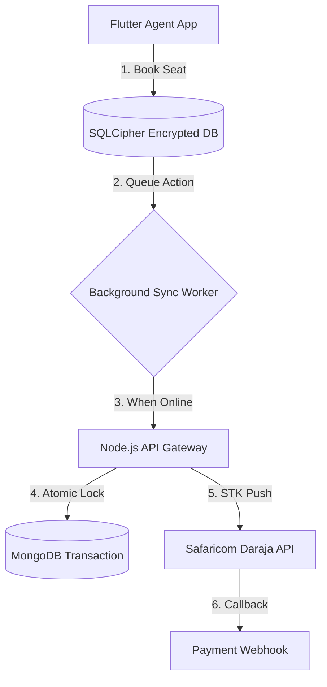

# TransitCore (POC)

**A Offline-First Seat Reservation Engine designed for low-connectivity logistics environments.**

TransitCore solves the "Double Booking" problem in inter-city bus travel using a **Graph-Based Locking Mechanism** and enables field agents to operate without internet access using **Optimistic UI & Background Sync**.

##  System Architecture



##  Key Technical Features

### 1. Offline-First Architecture (`lib/services/offline_manager.dart`)

* **Encrypted Storage:** Uses `sqflite_sqlcipher` to store sensitive passenger manifests locally.
* **Optimistic UI:** Agent actions (e.g., "Validate Ticket") update the UI immediately, while the request is queued in a `sync_queue` table.
* **Conflict Resolution:** The server timestamp wins in case of data divergence during re-sync.

### 2. Dynamic Segment Locking (`backend/dynamic_routing.js`)

* Prevents revenue loss on multi-stop routes (e.g., Nairobi -> Nakuru -> Eldoret).
* **Logic:** If a user books "Nairobi -> Nakuru" (Segment A), the system atomically locks Seat #4 for Segment A but keeps Segment B (Nakuru -> Eldoret) open for booking.

### 3. Payment Integration (`backend/services/mpesa.js`)

* **Async Payments:** Implements Safaricom's **Lipa Na M-Pesa Online (STK Push)**.
* **Webhook Handling:** Processes asynchronous callbacks to confirm ticket generation only after funds are secured.

##  Tech Stack

* **Mobile:** Flutter (Dart), SQFLite, Provider
* **Backend:** Node.js, Express, Mongoose
* **Database:** MongoDB (Atlas), Redis (Session Locking)

##  Proof of Concept Status

This repository contains the **Architectural Core** validation logic.

*  **Flutter UI:** Seat selection grid implemented.
*  **Locking Logic:** Transactional locking for segments active.
*  **Offline Sync:** Queue pattern established.

```
